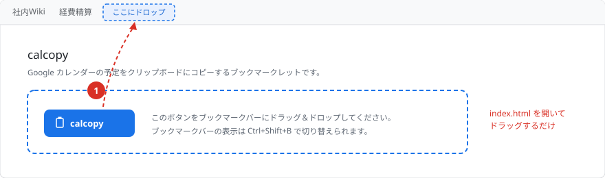
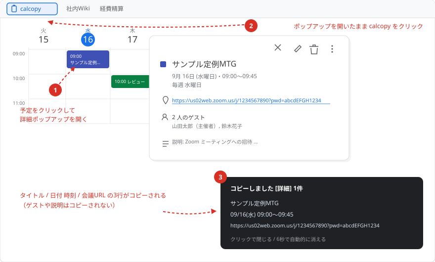
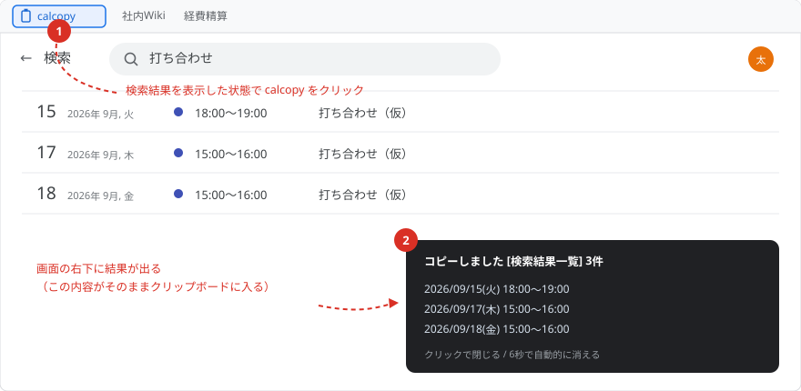

# calcopy

Google カレンダーの予定をクリップボードにコピーするブックマークレット。
実行した**場所に応じて動作が自動で切り替わります**。

| 実行する場所 | コピーされるもの |
| --- | --- |
| **予定の詳細**（予定をクリックして出るポップアップ） | その予定 1 件 — タイトル / 日付 + 時刻 / 会議 URL |
| **検索結果一覧**（検索窓から検索した画面） | 一覧のすべての予定 — 日付 + 時刻 |

> 以下の画面イメージはすべてダミーデータです。

## インストール



インストールページ `index.html` をブラウザで開き、青い **calcopy** ボタンを
**ブックマークバーにドラッグ＆ドロップ**します。これだけで完了です。

```bash
# 空きポートでサーバーを起動してインストールページを開く（WSL の場合）
python3 -m http.server 8080 &
powershell.exe -NoProfile -Command "Start-Process 'http://localhost:8080/index.html'"
```

ブックマークバーが隠れているときは `Ctrl+Shift+B` で表示できます。
手で登録したい場合は、`calcopy.bookmarklet.txt` の中身を新規ブックマークの「URL」欄に貼り付けてください。

## 使い方

Google カレンダーを開いた状態で、ブックマークバーの **calcopy** をクリックします。
コピー結果は画面右下にトーストで表示されます（クリックで閉じる / 6 秒で自動的に消える）。

### 1. 予定 1 件をコピーする（詳細ポップアップ）



1. コピーしたい予定をクリックして、詳細ポップアップを開く
2. ポップアップを**開いたまま** calcopy をクリック
3. 次の 3 行がクリップボードに入る

```
サンプル定例MTG
09/16(水) 09:00～09:45
https://us02web.zoom.us/j/1234567890?pwd=…
```

- 日 / 週 / 月ビューでも、検索結果一覧からでも、ポップアップを開けば同じように使えます。
- 3 行目は **Google Meet / Zoom / Teams** の URL があるときだけ付きます。
  場所欄のリンク → Meet の参加ボタン → 説明欄の本文、の順に探します。
  会議 URL が無い予定（物理的な会議室だけ、場所なし）では 2 行になります。
- ゲストや説明はコピーされません。
- 詳細ポップアップには年が表示されないため、日付は `月/日(曜)` です。
  別の年の予定など、画面に年が出ている場合だけ `2027/03/16(火)` の形式になります。

### 2. 検索結果をまとめてコピーする



1. カレンダー上部の検索窓で検索し、結果一覧を表示する
2. calcopy をクリック
3. 一覧のすべての予定が、1 行 1 件でクリップボードに入る

```
2026/09/15(火) 18:00～19:00
2026/09/17(木) 15:00～16:00
2026/09/18(金) 15:00～16:00
```

日付と時刻をスペースでつなぎます。タイトルは付きません。

### コピーされない場合

- **詳細ポップアップを開いていない日 / 週 / 月ビュー** では何もコピーせず、
  「Google カレンダーの検索結果、または予定の詳細を開いた状態で実行してください。」と表示します。
- 詳細ポップアップが開いているときは、どの画面でも**つねに「詳細」モードが優先**されます。
  検索結果をまとめてコピーしたいときは、ポップアップを閉じてから実行してください。

## 開発

| ファイル | 役割 |
| --- | --- |
| `calcopy.src.js` | **編集するのはここだけ**。コメント付きの本体 |
| `build.py` | ビルドスクリプト |
| `calcopy.min.js` | 生成物（terser による圧縮版） |
| `calcopy.bookmarklet.txt` | 生成物（`javascript:` URL） |
| `index.template.html` | インストールページの雛形 |
| `index.html` | 生成物 |
| `test.js` | jsdom による回帰テスト |
| `docs/*.svg` | README 用の画面イメージ（すべてダミーデータの手描き SVG） |
| `.gitignore` | `node_modules` と画像（実データが写りうる）を除外 |

```bash
uv run build.py
```

`terser` は `npx` 経由で取得します。`npx` が無い環境では圧縮せずにそのまま埋め込みます。

### テスト

実際の DOM から採取した構造を jsdom で再現し、ビルド済みのブックマークレットを実行します。

```bash
npm install jsdom
node test.js
```

fixture の氏名・会議 URL はすべてダミーです。実データは含めないでください。

## 実装メモ

Google カレンダーの DOM はクラス名が難読化されているため、比較的安定した手がかりを使っています。

- **モード判定** — 詳細は `div[data-actions-expanded]`、検索結果は `div[role=rowgroup][data-datekey]`。
  どちらでもなければ何もしません。
- **詳細ポップアップの各項目** — Google が振っている固定 ID を利用: `#xDetDlgWhen`（タイトル・日時）。
- **会議 URL** — ダイアログ内の `a[href]` を DOM 順に走査し、`meet.google.com` / `zoom.us` /
  `teams.microsoft.com` / `teams.live.com` にマッチする最初のものを採用します。
  リンクが無ければ本文テキストからも探します（説明欄にプレーンテキストで貼られている場合）。
  URL に使える ASCII 文字だけを拾うため、直後に日本語が続いていても巻き込みません。
- **年** — 画面に出ている表記だけを使い、補完はしません。詳細ポップアップの日時は
  `9月 16日 (水曜日)⋅09:00～09:45` のように年を含まないため `09/16(水)` になります。
- **`data-datekey` の解読** — `((year-1970) << 9) | (month << 5) | day`。
  検索結果一覧で、予定の読み上げラベルから日付が取れなかったときの控えに使います。
- **クリップボード** — `navigator.clipboard.writeText()` を使い、未フォーカス等で拒否された場合は
  `textarea` + `document.execCommand('copy')` に退避します。
